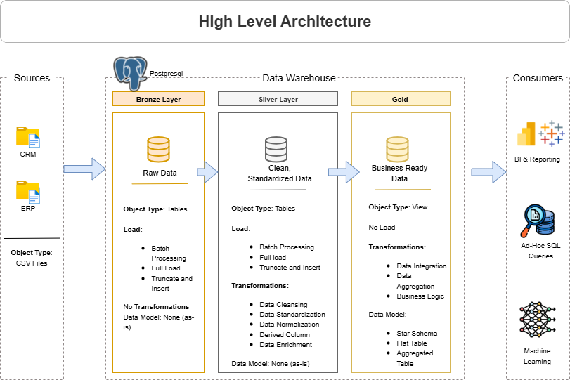

# Customer Sales Data Warehouse Project

## 📌 Project Overview

This project demonstrates a modern data warehouse design using a **Bronze → Silver → Gold** layered architecture. It ingests raw customer and sales data from multiple sources (e.g., CRM, ERP), transforms and cleanses it, and provides a reporting-ready data model for downstream analytics.

---

## 🏗️ Data Architecture

The data architecture for this project follows Medallion Architecture **Bronze**, **Silver**, and **Gold** layers:


1. **Bronze Layer**: Stores raw data as-is from the source systems. Data is ingested from CSV Files into Posgresql Database.
2. **Silver Layer**: This layer includes data cleansing, standardization, and normalization processes to prepare data for analysis.
3. **Gold Layer**: Houses business-ready data modeled into a star schema required for reporting and analytics.

---
## 📖 Project Overview

This project involves:

1. **Data Architecture**: Designing a Modern Data Warehouse Using Medallion Architecture **Bronze**, **Silver**, and **Gold** layers.
2. **ETL Pipelines**: Extracting, transforming, and loading data from source systems into the warehouse.
3. **Data Modeling**: Developing fact and dimension tables optimized for analytical queries.
4. **Analytics & Reporting**: Creating SQL-based reports and dashboards for actionable insights.

---

## 🚀 Project Requirements

### Building the Data Warehouse (Data Engineering)

#### Objective
Develop a modern data warehouse using Postgresql to consolidate sales data, enabling analytical reporting and informed decision-making.

#### Specifications
- **Data Sources**: Import data from two source systems (ERP and CRM) provided as CSV files.
- **Data Quality**: Cleanse and resolve data quality issues prior to analysis.
- **Integration**: Combine both sources into a single, user-friendly data model designed for analytical queries.
- **Scope**: Focus on the latest dataset only; historization of data is not required.
- **Documentation**: Provide clear documentation of the data model to support both business stakeholders and analytics teams.

---

## ⚙️ Technologies Used

- **PostgreSQL** (data warehouse engine)
- **Docker Compose** (container orchestration)
- **SQL** / PL/pgSQL (for ETL stored procedures)
- **Draw.io** (data lineage / data flow documentation)
- **VS Code** (code editor)

---

## 📂 Repository Structure
```
data-warehouse-project/
│
├── datasets/                           # Raw datasets used for the project (ERP and CRM data)
│
├── docs/                               # Project documentation and architecture details
│   ├── data_architecture.drawio        # Draw.io file shows the project's architecture
│   ├── data_catalog.md                 # Catalog of datasets, including field descriptions and metadata
│   ├── data_flow.drawio                # Draw.io file for the data flow diagram
│   ├── data_models.drawio              # Draw.io file for data models (star schema)
│   ├── naming_conventions.md           # Consistent naming guidelines for tables, columns, and files
│
├── scripts/                            # SQL scripts for ETL and transformations
│   ├── bronze/                         # Scripts for extracting and loading raw data
│   ├── silver/                         # Scripts for cleaning and transforming data
│   ├── gold/                           # Scripts for creating analytical models
│
├── tests/                              # Test scripts and quality files
│
├── README.md                           # Project overview and instructions
├── LICENSE                             # License information for the repository
├── .gitignore                          # Files and directories to be ignored by Git
└── docker-compose.yaml                 # Dependencies and requirements for the project
```

--- 

## 🛠️ ETL Process

- Bronze tables ingest raw data, including duplicates and inconsistent data
- Silver ETL procedure (implemented as a stored procedure in PostgreSQL) truncates and reloads cleansed, conformed data
- Gold layer is represented by a reporting view or materialized view for analytics tools
- Data lineage is documented in Draw.io

---

## 🛠️ Installation and Setup

1. **Clone this repository**

```bash
git clone https://github.com/Isioma57/sql_data_warehouse_project.git
cd sql_datawarehouse_project
```

2. **Create and activate a Python virtual environment using the following commands**

For Window Users:
```bash
python -m venv venv
source venv/Scripts/activate
```
For Unix-based systems:
```bash
python3 -m venv venv
source venv/bin/activate
```

3. **Configuration**
Before running the scripts, you need to set the following environment variables:

        POSTGRES_USER: The username for the PostgreSQL database.

        POSTGRES_PASSWORD: The password for the PostgreSQL database.

        POSTGRES_DB: The name of the PostgreSQL database.

        POSTGRES_PORT: The port for the PostgreSQL database. (Default is 5432)

You can set these environment variables in the .env file in the directory of the project with the following format:
```
POSTGRES_USER=your_username
POSTGRES_PASSWORD=your_password
POSTGRES_DB=your_database
POSTGRES_PORT=your_port
```

---

## 🚀 How to Run
- Once your .env file has been accurately set up with the necessary environment variables, simply run the following command to start the PostgreSQL service:
```bash
docker-compose up
```

You can also run the command in detached mode with:
```bash
docker-compose up -d
```
-  Initialize the Database:

Your Postgres container will automatically run the initialization script (bronze/init.sql) to load the Bronze layer with sample data.

- Run the ETL:

1. Inside your Postgres client (e.g., pgAdmin or psql), execute the stored procedure to load the data:
```
CALL bronze.load_bronze();
```
2. Create the ddl for the silver layer

3. Inside your Postgres client (e.g., pgAdmin or psql), execute the stored procedure to load the data into the silver layer:
```
CALL silver.load_silver_data();
```
4. Run the script in the gold layer to create a view for reporting and BI.

---

## 🧪 Testing

All transformations are validated using simple SELECT checks.

The stored procedure is idempotent (you can rerun without duplication).

## 🔧 General Troubleshooting

If you encounter issues during setup or execution, consider the following:

- Ensure Docker and Docker Compose are running properly.
- Verify that the environment variables in the .env file are correctly set.
- Check the Docker container logs for any error messages.

---

## 📄 Additional Documentation

For a detailed breakdown of project design, see my [Notion page](https://www.notion.so/SQL-Data-Warehouse-Project-21cdd86a240e80bea555e6ff52bb595a?source=copy_link).

---

## 🛡️ License

This project is licensed under the MIT License. See the LICENSE file for details.